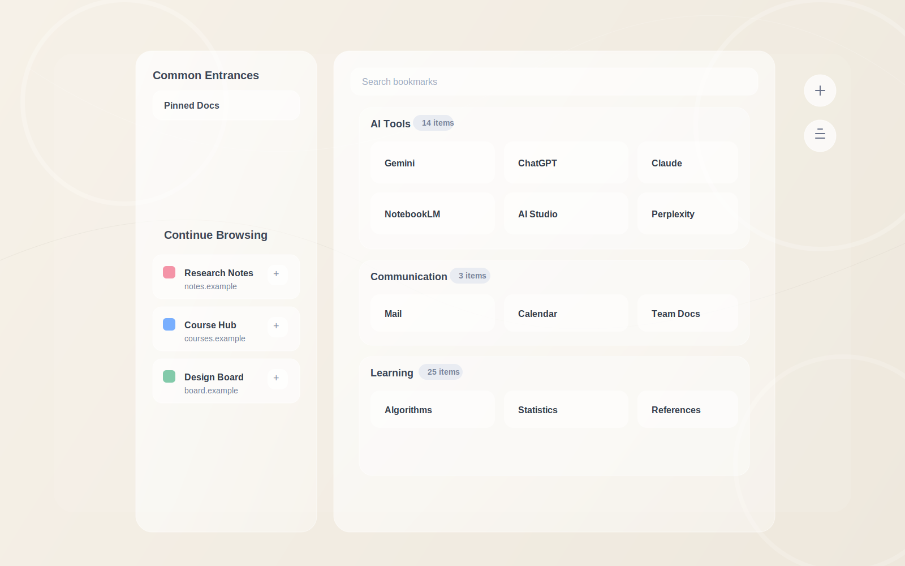

# Luma Tab

Luma Tab 是一个用于替换 Chrome 新标签页的扩展，目标是把「常用页面、书签整理、轻量 AI 分类」放进一个安静、易用的工作台里。

项目当前基于 `React + TypeScript + Vite` 开发，并通过 Chrome Extension Manifest V3 运行。

## 界面示意

下面这张图基于项目实际截图整理，并只保留适合公开展示的界面内容。它主要用来展示布局、层级和交互区域，不包含账号信息、地址栏历史或其他敏感数据。



## 功能特性

- 替换 Chrome 新标签页
- 读取并展示浏览器书签
- 支持手动创建分组、拖拽整理、重命名和删除书签
- 支持固定常用页面
- 根据最近访问记录生成 `Continue` 区域，方便继续上次工作
- 接入 DeepSeek，对书签进行 AI 分组和页面名称简化
- 支持导出 / 导入应用数据，便于迁移配置

## 技术栈

- React 18
- TypeScript
- Vite
- `@dnd-kit` 拖拽排序
- `lucide-react` 图标
- Chrome Extension Manifest V3

## 权限说明

扩展当前使用以下权限：

- `bookmarks`：读取和整理浏览器书签
- `storage`：保存分组、固定页面、缓存和 API Key
- `tabs`：配合页面打开与访问记录能力
- `https://api.deepseek.com/*`：调用 DeepSeek 接口进行 AI 分类

## 安装方式

### 方式一：加载已构建版本

仓库里已包含 `release/` 目录，可直接加载解压后的扩展：

1. 打开 Chrome 并访问 `chrome://extensions/`
2. 开启右上角 `Developer mode`
3. 点击 `Load unpacked`
4. 选择 `release/Luma-Tab-v1.0.1/` 目录

如果你使用压缩包，也可以先解压：

- `release/Luma-Tab-v1.0.0-unpacked.zip`

### 方式二：本地开发构建后加载

```bash
npm install
npm run build
```

构建完成后，在 Chrome 扩展页面加载构建产物目录即可。

提示：当前项目的发布产物位于 `release/`，如果你希望把 Vite 默认构建结果直接用于扩展加载，建议先确认构建输出目录与 `manifest.json`、背景脚本路径是否一致。

## 本地开发

安装依赖：

```bash
npm install
```

启动 Vite 开发环境：

```bash
npm run dev
```

生产构建：

```bash
npm run build
```

预览构建结果：

```bash
npm run preview
```

## 使用说明

### 1. 设置 DeepSeek API Key

打开新标签页后，点击右上角 `Settings`：

- 在 `API` 区域填入 DeepSeek API Key
- 点击 `Save Key` 保存
- 如需清除可点击 `Clear Key`

未配置 API Key 时，AI 分类相关功能不可用。

### 2. 整理书签

点击页面中的 `Edit` 按钮后可以：

- 新建分组
- 拖拽排序书签和分组
- 编辑书签标题、链接和描述
- 删除书签或取消本次草稿修改

### 3. 使用 AI 分类

在 `Edit` 面板的 `AI` 区域中：

- `Sort all`：对全部书签重新分组
- `Sort ungrouped`：仅整理未分组书签
- `Check`：先验证当前 AI 能力是否可用
- `Run`：执行 AI 分类

### 4. 迁移数据

在 `Settings` 的 `Data` 区域中：

- `Export`：导出当前配置与数据
- `Import`：导入之前导出的数据文件

这适合重装扩展、切换设备或备份分类结果时使用。

## 左侧栏逻辑

左侧栏由 [`src/components/LeftPanel.tsx`](/Users/zyh/Projects/Luma%20Tab/src/components/LeftPanel.tsx) 驱动，核心目标是把“我主动固定的重要入口”和“我最近可能还要继续看的页面”同时放到视线最短路径上。

### 1. 两块数据，各自解决不同问题

- `Common Entrances` 对应 `pinnedPages`
  - 数据来源是本地存储里的固定页面列表，读取函数是 [`getPinnedPages()`](/Users/zyh/Projects/Luma%20Tab/src/lib/storage.ts)
  - 这部分是用户显式维护的快捷入口，强调稳定和可控
- `Continue Browsing` 对应 `rawTimeLog`
  - 数据来源是浏览记录时间日志，读取函数是 [`getRawTimeLog()`](/Users/zyh/Projects/Luma%20Tab/src/lib/storage.ts)
  - 组件会先过滤停留时间太短的记录，再按域名聚合，最后只保留每个站点最近一次值得继续的页面

### 2. Continue 区域如何算出来

左侧栏里有两个关键辅助函数：

- `getEntryDomain(entry)`
  - 优先使用日志里已有的 `domain`
  - 如果没有，就从 URL 里解析 hostname，并去掉 `www.`
- `buildContinuePages(entries)`
  - 先过滤掉停留时间不足 `3 * 60 * 1000` 毫秒的记录
  - 再按域名分组，只保留每个域名最新的一条
  - 最后按最近访问时间倒序排列，并截断为最多 6 条

这意味着左侧栏不会简单地把所有历史访问都堆出来，而是更偏向“最近真正使用过、值得继续打开的页面”。

### 3. 标题显示不是单一来源，而是三层兜底

左侧栏显示名称时，不直接相信单一字段，而是做了分层回退：

- 固定页名称优先级：`customName -> urlNameCache[url] -> bookmarkTitleByUrl[url] -> 原始 title`
- Continue 名称优先级：`urlNameCache[url] -> bookmarkTitleByUrl[url] -> 访问记录里的 title`

这套逻辑的价值是：

- 用户手动改过的名字永远优先
- 如果某个页面名称被 AI 简化过，可以复用到多个位置
- 即使没有缓存，也还能退回浏览器书签标题或原始页面标题

### 4. 为什么会去读全部书签

组件初始化时不仅会读取固定页、时间日志和名称缓存，也会调用 `getAllBookmarks()`。原因不是为了重新渲染整个书签墙，而是为了做两件事：

- 把 `pinnedPages` 和最新书签数据对齐，避免固定页标题、URL 已经变化但侧栏没更新
- 构造 `bookmarkTitleByUrl`，作为左侧栏名称展示的一个兜底数据源

代码里 `syncPinnedPagesWithBookmarks(...)` 就负责这一步同步。

### 5. DeepSeek 在左侧栏里做什么

左侧栏并不负责“整站分类”，但会调用 `simplifyPageNamesWithDeepSeek(...)` 做一件很实用的小事：把 Continue 区域里难读、太长或不稳定的页面标题改成更适合快速识别的短名称。

这个过程有几个约束：

- 只处理 `urlNameCache` 里还没有命中的页面
- 只有用户配置了 DeepSeek API Key 才会触发
- 结果会写回 `urlNameCache`，所以下次进入页面不需要重复请求
- 组件内部用 `isRefreshingContinueNamesRef` 和 `pendingContinuePagesRef` 避免重复并发刷新

换句话说，左侧栏里的 AI 不是“决定看什么”，而是“把已经值得继续看的页面命名得更顺手”。

### 6. 左侧栏如何保持实时同步

这个组件做了两层监听：

- 监听 `chrome.bookmarks` 事件
  - 当书签新增、删除、修改时，重新拉取书签并同步 `pinnedPages`
- 监听 `chrome.storage.onChanged`
  - `pinnedPages` 变化时，直接刷新固定入口
  - `urlNameCache` 变化时，刷新展示名称
  - `rawTimeLog` 变化时，重新计算 Continue 列表，并在必要时触发名称简化

这让左侧栏即使不刷新整个页面，也能跟上后台追踪、设置修改和书签变动。

### 7. 左侧栏支持哪些交互

- 点击卡片：直接打开目标页面
- Continue 卡片点击图钉：加入 `Common Entrances`
- 固定页点击取消固定：从 `pinnedPages` 移除
- 两类卡片都支持更多操作菜单
  - 可编辑自定义名称
  - Continue 项可从时间日志里移除对应域名记录
- 编辑名称时支持 `Enter` 保存、`Escape` 取消、失焦自动保存

整体上，左侧栏的设计取向不是做成第二个完整书签管理器，而是做成一个“轻量、即时、低打扰”的恢复工作区入口。

## 项目结构

```text
.
├── docs/                   # README 使用的脱敏示意图等文档资源
├── public/                 # 扩展清单、图标和静态资源
├── release/                # 已打包的发布版本
├── src/
│   ├── components/         # 左侧栏、右侧书签区、设置面板等 UI 组件
│   ├── lib/                # 存储、书签读取、背景图、DeepSeek 调用等能力
│   ├── types/              # 类型定义
│   ├── App.tsx             # 应用主入口
│   └── background.ts       # 扩展后台逻辑
├── package.json
└── vite.config.ts
```

## 发布说明

当前仓库内可见的发布产物包括：

- `release/Luma-Tab-v1.0.0/`
- `release/Luma-Tab-v1.0.1/`
- `release/Luma-Tab-v1.0.0-unpacked.zip`

如果要对外发布，建议在每次版本更新时同步：

- 更新 `public/manifest.json` 中的版本号
- 重新构建扩展资源
- 在 `release/` 下保留对应版本目录或压缩包

## 注意事项

- DeepSeek 能力依赖你自己的 API Key，相关费用与配额由你的 DeepSeek 账户决定
- API Key 当前保存在扩展本地存储中，适合个人使用场景
- 如果书签数量很多，首次 AI 分类可能需要更长时间

## License

当前仓库未声明开源许可证。如需开源发布，建议补充 `LICENSE` 文件。
