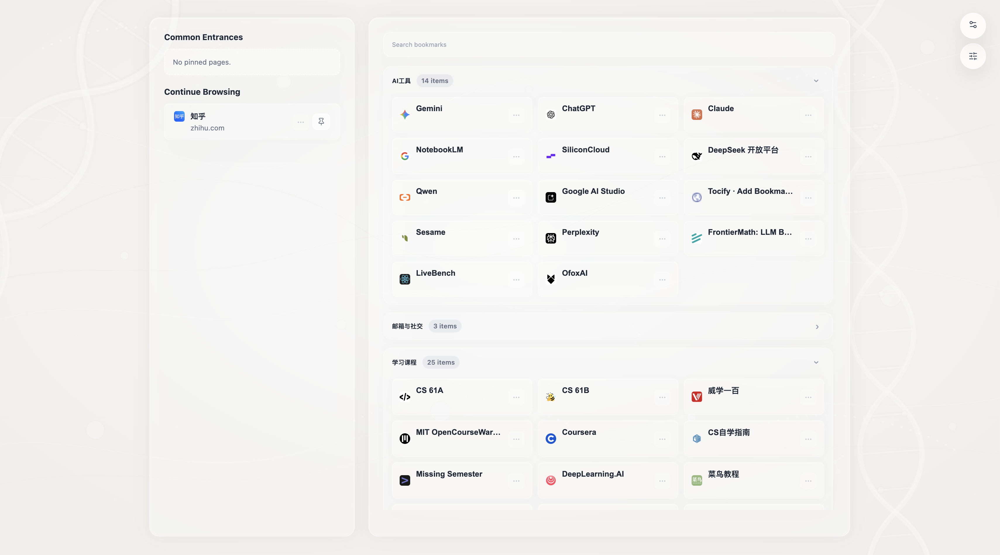

# Luma Tab

Luma Tab 是一个替代 Chrome 新标签页的扩展。它把「常用入口」「最近值得继续的页面」「可编辑书签分组」和「轻量 AI 整理」放进同一个工作台里，目标不是做一个更重的书签管理器，而是让你每次打开新标签页时，能更快回到正在做的事。

项目基于 `React + TypeScript + Vite` 构建，运行在 Chrome Extension Manifest V3 上。

## Screenshot



## What It Does

- 替换 Chrome 新标签页
- 读取并展示浏览器书签
- 支持自定义书签分组，并将未分组书签自动收纳到 `Unclassified`
- 支持拖拽调整分组和书签顺序
- 支持新建分组、重命名分组、删除分组
- 支持编辑书签标题、链接和描述
- 支持固定常用页面到左侧快捷区
- 基于最近使用时长和时间新鲜度生成 `Continue Browsing`
- 支持对系列视频、课程、仓库、文档等上下文做聚合，只保留最后看的那一项
- 为聚合后的 continue 项显示更明确的副标题，例如 `playlist`、`series`、`repo`、`course`
- 支持隐藏不想出现在左侧的域名，并在设置面板恢复
- 接入 DeepSeek，支持整批分类、仅整理未分组书签，以及页面名称精简
- 新增书签时可尝试自动归入已有分组
- 支持导出 / 导入本地数据

## Product Structure

页面主要分成三块：

- 左侧栏：显示问候、时间、固定入口和 `Continue Browsing`
- 中右主区：显示书签搜索、分组列表和书签卡片
- 右上角浮层入口：`Settings` 和 `Edit`

### Left Panel

左侧栏由 [`src/components/LeftPanel.tsx`](/Users/zyh/Projects/Luma%20Tab/src/components/LeftPanel.tsx) 驱动，负责两个核心场景：

- `Common Entrances`
  - 来自 `pinnedPages`
  - 适合长期固定的常用入口
- `Continue Browsing`
  - 来自后台记录的 `rawTimeLog`
  - 更偏向最近真的花过时间、值得继续的页面

`Continue Browsing` 不是简单罗列浏览历史，而是会：

- 过滤停留时间过短的记录
- 对最近 72 小时内的使用数据做规范化和聚合
- 按“最近访问 + 使用时长”综合排序
- 最多展示 6 条

聚合规则目前分成两层：

- 普通网页：按规范化后的 URL 聚合，并过滤常见分享 / 追踪参数
- 上下文型站点：按“同一个工作或学习上下文”聚合，只保留最后看的那一项

目前已经覆盖的上下文型站点包括：

- `YouTube`：按 `playlist` 聚合
- `Bilibili`：按 `series / collection / 多 P 视频` 聚合
- `GitHub`：按 `owner/repo` 聚合
- `Coursera`、`edX`、`Udemy`：按课程聚合
- `Notion`：按 workspace / page 上下文聚合
- `Google Docs / Sheets / Slides`：按文档 ID 聚合
- `Figma`：按 file / prototype / figjam 资源聚合
- `飞书 / Lark`：按 doc / sheet / base / wiki / minutes 资源聚合
- `语雀`：按知识库聚合
- `Confluence`：按 `space` 聚合

左侧项目支持：

- 点击直接打开页面
- 一键固定 / 取消固定
- 自定义名称
- 从继续浏览列表中隐藏某个域名
- 通过副标题快速识别当前条目属于 `playlist`、`course`、`repo`、`doc`、`sheet` 等哪种上下文

如果配置了 DeepSeek API Key，左侧栏还会尝试把冗长网页标题精简成更适合扫读的短名称，并缓存到 `urlNameCache`。

### Bookmark Area

右侧书签区由 [`src/components/RightPanel.tsx`](/Users/zyh/Projects/Luma%20Tab/src/components/RightPanel.tsx) 驱动，负责书签浏览和分组编辑。

当前支持：

- 书签搜索
- 分组展开 / 收起
- 拖拽排序分组
- 拖拽书签到不同分组
- 在编辑态下新建分组、重命名、删除
- 编辑单条书签的标题、URL 和描述
- 对 AI 生成的新分组进行接受或拒绝
- 在分组目录中点击某个分组名称后，平滑滚动跳转到对应内容区域

分组数据保存在 `bookmarkPanelState.virtualCategories`，未被分配到任何分组的书签会自动落入系统分组 `Unclassified`。

### Settings And Edit Popovers

- [`src/components/SettingsPanel.tsx`](/Users/zyh/Projects/Luma%20Tab/src/components/SettingsPanel.tsx)
  - 保存 / 清除 DeepSeek API Key
  - 导出 / 导入本地数据
  - 管理被隐藏的左侧域名
- [`src/components/OrganizePanel.tsx`](/Users/zyh/Projects/Luma%20Tab/src/components/OrganizePanel.tsx)
  - 进入草稿编辑态
  - 新建分组
  - 保存或取消本次整理
  - 校验 AI 分类链路
  - 运行整批 AI 分类

## AI Workflow

AI 能力集中在 [`src/lib/deepseek.ts`](/Users/zyh/Projects/Luma%20Tab/src/lib/deepseek.ts) 和 [`src/background.ts`](/Users/zyh/Projects/Luma%20Tab/src/background.ts)。

目前有三类 AI 使用方式：

1. 全量分类
   - 对所有书签重新生成 4-6 个核心分组
2. 增量分类
   - 新增书签后，尝试自动归入已有分组
3. 名称精简
   - 为左侧继续浏览项目生成更短、更稳定的展示名称

实现上有几个比较重要的约束：

- 请求模型为 `deepseek-v4-flash`
- 提示词要求模型只返回合法 JSON
- 未命中的内容会回退到 `Unclassified`
- API Key 为空时不会触发 AI 请求
- API Key 会优先走 [`src/lib/secureStorage.ts`](/Users/zyh/Projects/Luma%20Tab/src/lib/secureStorage.ts) 中的加密存储逻辑

## Storage Model

应用主要把状态存到 `chrome.storage.local`，关键字段包括：

- `bookmarkPanelState`：分组展开状态和虚拟分组结构
- `pinnedPages`：左侧固定入口
- `rawTimeLog`：最近浏览时长日志
- `urlNameCache`：AI 精简后的页面名称缓存
- `bookmarkMetadata`：书签描述等附加信息
- `hiddenLeftPanelDomains`：被隐藏的继续浏览域名

后台脚本会监听标签页切换和窗口焦点变化，把足够长的浏览会话写入 `rawTimeLog`。左侧栏会在运行时基于这些原始记录计算 continue 分组 key、上下文类型和展示副标题，从而支撑 `Continue Browsing` 的推荐结果。

## Tech Stack

- React 18
- TypeScript
- Vite 5
- Chrome Extension Manifest V3
- `@dnd-kit` for drag and drop
- `lucide-react` for icons

## Permissions

扩展当前使用以下权限：

- `bookmarks`：读取和整理浏览器书签
- `storage`：保存分组、缓存、设置和本地数据
- `tabs`：记录活跃页面，用于继续浏览和自动整理流程
- `https://api.deepseek.com/*`：调用 DeepSeek API

## Install

### Option 1: Load The Latest Release Snapshot

如果你只是想直接安装当前仓库里最新整理好的扩展包，优先加载：

- `release/Luma-Tab-v1.0.2/`
- `release/Luma-Tab-v1.0.2-unpacked.zip`

历史快照也仍然保留在仓库里：

- `release/Luma-Tab-v1.0.1/`
- `release/Luma-Tab-v1.0.0/`
- `release/Luma-Tab-v1.0.0-unpacked.zip`

加载方式：

1. 打开 `chrome://extensions/`
2. 开启右上角 `Developer mode`
3. 点击 `Load unpacked`
4. 选择对应的 release 目录，或者先解压 zip 再加载

### Option 2: Build The Latest Source

如果你想基于当前源码自己构建，或者继续开发，这是推荐方式：

```bash
npm install
npm run build
```

构建完成后，将生成结果作为 unpacked extension 加载到 Chrome。

1. 打开 `chrome://extensions/`
2. 开启右上角 `Developer mode`
3. 点击 `Load unpacked`
4. 选择本地构建输出目录

## Local Development

```bash
npm install
npm run dev
```

可用脚本：

- `npm run dev`：启动 Vite 开发环境
- `npm run build`：执行 TypeScript 检查并构建
- `npm run preview`：预览构建结果

## Typical Usage

### 1. 配置 API Key

打开新标签页，点击右上角 `Settings`：

- 在 `API` 区域输入 DeepSeek API Key
- 点击 `Save Key`
- 需要清空时点击 `Clear Key`

### 2. 整理书签

点击右上角 `Edit`：

- `New Group` 新建分组
- 直接拖拽分组和书签
- 在编辑态中修改分组名
- 打开书签卡片菜单，编辑标题、链接和描述
- `Save` 保存草稿，`Cancel` 放弃草稿

### 3. 运行 AI 分类

在 `Edit` 面板中：

- `Sort all`：重建整套分组
- `Sort ungrouped`：仅处理未分组书签
- `Check`：先验证当前 API 和提示词链路
- `Run`：执行分类

### 4. 使用继续浏览

左侧 `Continue Browsing` 会展示最近真正使用过的页面。你可以：

- 直接继续打开
- 将其中某项固定到 `Common Entrances`
- 看到更明确的上下文副标题，例如 `playlist • youtube.com`、`repo • github.com`、`course • coursera.org`
- 隐藏不想再看到的域名
- 修改展示名称，让列表更贴近自己的心智模型

### 5. 迁移数据

在 `Settings > Data` 中：

- `Export` 导出当前本地数据
- `Import` 导回之前的配置和整理结果

## Project Structure

```text
.
├── docs/                   # README 截图与文档资源
├── public/                 # manifest、图标与静态资源
├── release/                # 已打包的扩展版本
├── src/
│   ├── components/         # 左右面板、设置面板、编辑面板等 UI
│   ├── lib/                # 存储、书签读取、AI、背景图等能力
│   ├── types/              # 类型定义
│   ├── App.tsx             # 应用装配入口
│   └── background.ts       # 后台跟踪与增量 AI 分类
├── package.json
└── vite.config.ts
```

## Current Status

这是一个已经可用、并且在持续细化交互的 Chrome 新标签页扩展。当前版本已经覆盖：

- 左侧工作恢复入口
- 面向视频、课程、仓库、文档工作流的 continue 上下文聚合
- 右侧书签分组工作区
- DeepSeek 驱动的分类与标题精简
- 本地数据导入导出
- 新增书签后的增量自动归类

如果你想继续往下扩展，比较自然的方向会是主题系统、跨设备同步、更细粒度的筛选与统计能力。
